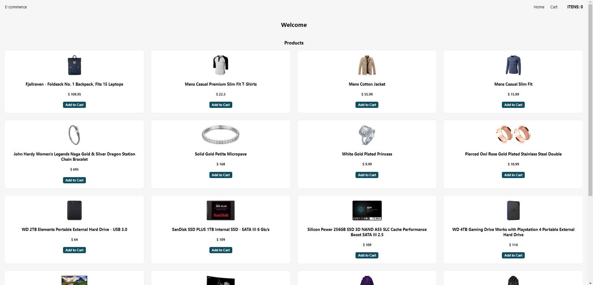
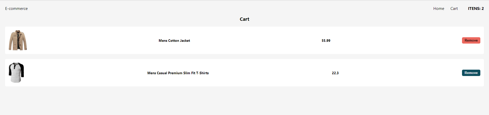

# E-Commerce API

## Cart Design

#

## Welcome! 👋

Thanks for checking out this front-end coding project.

**To make this project I needed React, CSS, JavaScript, State Manager (Redux), React Router and the REST API Fake Store API.**.

## The project

The project aims to build this E-Commerce and make it as responsive and intuitive as possible.

The customer can:

- Preview the optimal layout for the website depending on your device's screen size
- See hover states for all interactive elements on the page
- Add products in the cart
- Delete products of cart
- See the products for the buy

## Built with

- Javascript
- Flexbox
- [React](https://reactjs.org/) - JS library
- Redux
- CSS
- [Fake Store API](https://fakestoreapi.com/) (Rest API)

#

## Deploy

[Netlify](https://ecommerce-fake-api.netlify.app/)
